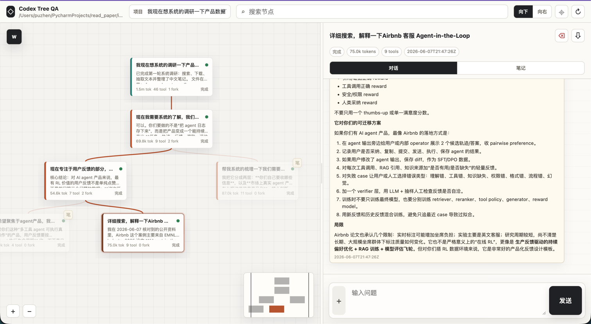

# Codex Tree QA

一个 Flask 版 Codex 问答前后端。每一轮 `user -> assistant` 是树上的一个节点，可以从任意节点继续发问，新的回答会成为该节点的子节点，因此同一节点可以并行 fork 多条会话。



## 运行

```bash
python3 -m venv .venv
. .venv/bin/activate
pip install -r requirements.txt
python app.py
```

默认地址是 <http://127.0.0.1:8080>，局域网内可通过本机 IP 的 8080 端口访问。

## 配置

默认会使用：

```bash
/Users/puzhen/PycharmProjects/datagen_mcp_toolathlon_ver_2/codex_token/auth_outlook_puzhen.json
```

可用环境变量覆盖：

```bash
CODEX_AUTH_FILE=/path/to/auth.json
CODEX_MODEL=gpt-5.5
CODEX_TIMEOUT_SECONDS=1200
PORT=8080
```

账号逻辑：

- 后端固定使用 `CODEX_AUTH_FILE` 指向的 auth 文件。
- 前端不显示账号状态，也不能设置账号。
- 每次运行会把 auth 文件复制到 `instance/codex_homes/<account>/auth.json`，通过 `CODEX_HOME` 给该次 `codex exec` 使用，不覆盖 `~/.codex/auth.json`。
- 后端调用 Codex 时固定启用 `--search` 和 `--dangerously-bypass-approvals-and-sandbox`，即允许 web search、bash 和完整本机执行权限。
- Codex JSONL 事件会写入节点，前端在 Agent 气泡内显示正在调用的工具、命令或搜索 query。

上传文件会存到 `instance/workspace/uploads/`，文本类文件会把片段放进 prompt，所有文件都会把本地路径传给 Codex。
